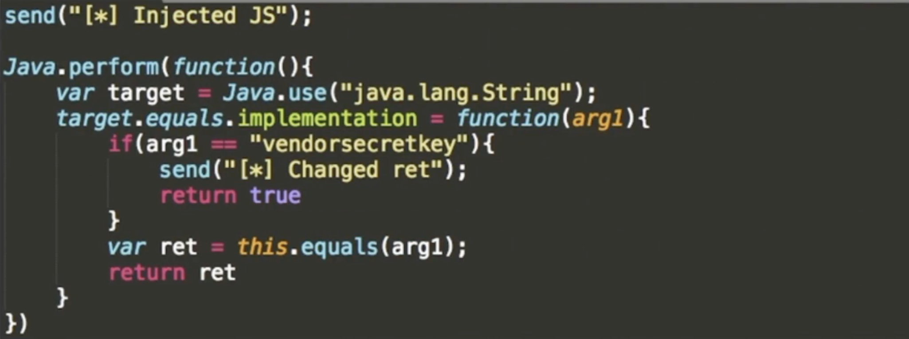
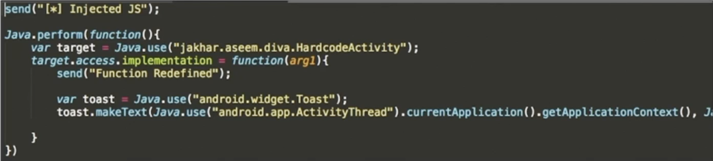
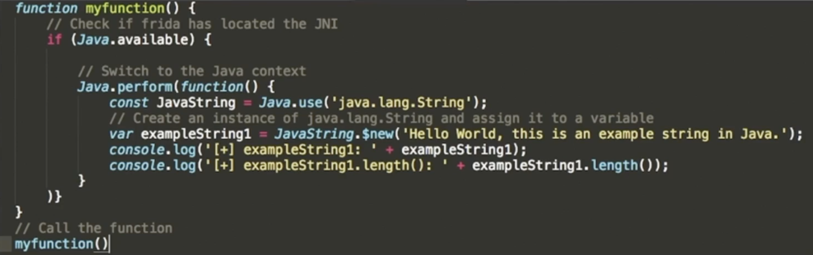

# App 데이터 변조 진단
- App이 서버와 통신하는 데이터 혹은 앱 내부에서 전달되는 함수 인자, 반환값 데이터 등을 변조하여 App 실행 흐름을 바꾸거나, 개발자가 의도하지 않은 동작을 유발할 수 있음
- 인증 우회나 인젝션 등 App 서비스에 대한 공격이 데이터 변조로 주로 이루어짐

**데이터 변조에 관련된 진단 항목(금취분평 기준)**
- 데이터를 변조하는 모든 진단 항목 (SQL 인젝션 , 인증, 인가와 관련된 취약점 등)

**데이터 변조 위치**
- 네트워크 통신 데이터 변조 : TCP 통신, HTTP 통신
- 메모리 내 데이터 변조 : 함수 인자, 반환값, 메모리 영역 데이터 변조
- - -
>## 네트워크 통신 구간 데이터 변조
- App 서버와 통신을 하는 과정에서 통신 데이터를 분석하고, 데이터를 변조함으로써 인증 우회, 파라미터 변조 등 다양한 공격을 수행 할 수 있음

### 네트워크 통신
- TCP 통신  
Native App, Hybrid App에서 앱 서버와 HTTP 통신이 아닌 TCP 통신을 하여 데이터를 주고 받는 경우가 있음. 이럴 경우 TCP Proxy를 사용하여 통신 데이터 분석 및 데이터 변조하여 진단 해야함<br></br>
- HTTP 통신  
Web App, Hybrid App에서 웹 서버와 HTTP 통신을 하여 데이터를 주고 받는 경우가 있음. 이럴 경우 HTTP Proxy를 사용하여 통신 데이터 분석 및 데이터 변조를 하여 진단해야 함

>## 메모리 데이터 변조
- App 실행 중 함수의 인자값 혹은 반환값, 임의 함수 실행 및 조작을 통해 App 클라이언트에서 이루어지는 인증 로직을 우회할 수 있고, App의 실행 흐름을 조작할 수 있음

### 메모리 데이터 변조 방법
- DBI(Dynamic Binary Instrument) 사용 : Frida

### 메모리 데이터 변조 이용
<details>
<summary><U>App Function 인자값&리턴값 변조</U></summary>
<div mardown="1">


</div>
</details>

<details>
<summary><U>App so Library Function 후킹 (Dynamic Load)</U></summary>
<div markdown="1">

```js
// 특정 라이브러리가 로드 되었을 때, 후킹하고 싶은 경우
send("[*] Injected JS");

var didHookapis = false;

// if it used "System.loadLibrary", we have hokk "android_dlopen_ext"
Interceptor.attach(Module.findExportByName(null, 'dlopen'), {
    onEnter: function(args)
    {
        this.path = Memory.readUtf8String(args[0]);
        console.log(this.path);
    },
    onLeave: function(retval)
    {
        if(!retval.isNull() && this.path.indexOf('libdivajni.so') !== -1 && !didHookapis){
            didHookapis = true;
            console.log("File loaded hooking");
            so_hook();
        }
    }
});

function so_hook(){
    var so_target = Module.findExportByName("libdivajni.so","Java_jakhar_aseem_diva_DivaJni_initiateLaunchSequence");
    Interceptor.attach(so_target, {
        onLeave: function(retval)
        {
            retval.replace(1);
            send("Function Called!!");
        }
    });
}
```
</div>
</details>

<details>
<summary><U>App Function 재정의</U></summary>
<div mardown="1">


</div>
</details>

<details>
<summary><U>App Function 호출</U></summary>
<div mardown="1">


</div>
</details>
