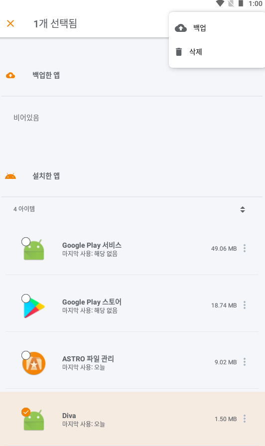
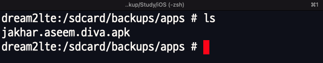
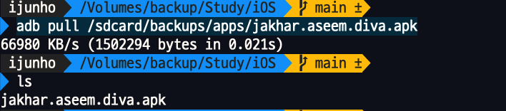
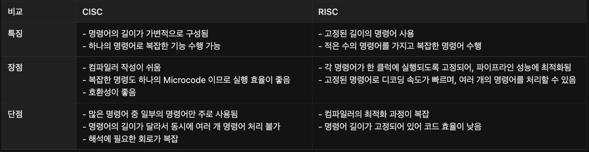
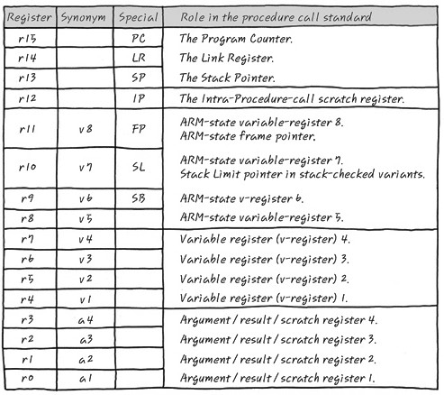

## APK 추출
### 백업 기능을 이용해서 추출

ASTRO 파일 관리자 설치
```xml
https://drive.google.com/file/d/1DWBTDjP1HQDAGszkn5fvNkzj0RP0xKnd/view?usp=sharing
```

앱 > 추출할 앱 선택(쭉) > 백업  
<p align="left">

```xml
$ adb shell
$ cd /sdcard/backups/apps  -> 백업된 앱 경로 및 파일명 확인

$ adb pull /sdcard/backups/apps/jakhar.aseem.diva.apk
```



## ARM 이란?
### CISC vs RISC
Advanced RISC Machine의 약자 CPU TYPE


### ARM 모드 / Thumb 모드Í

- ARM 과 x86 의 가장 큰 차이점은 Thumb 모드가 있다는  것
- THUMB 모드는 32bit ARM에서 동작하는 16bit 기계어

### ARM 모드 ←→ Thumb 모드

BLX / BX 등  X로 끝나는 분기문 명령으로 모드 전환
