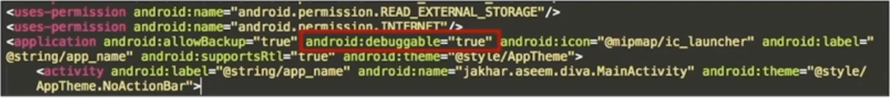
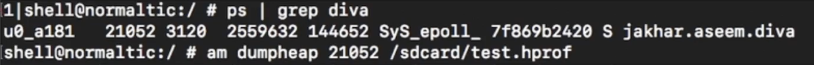
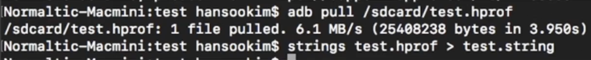
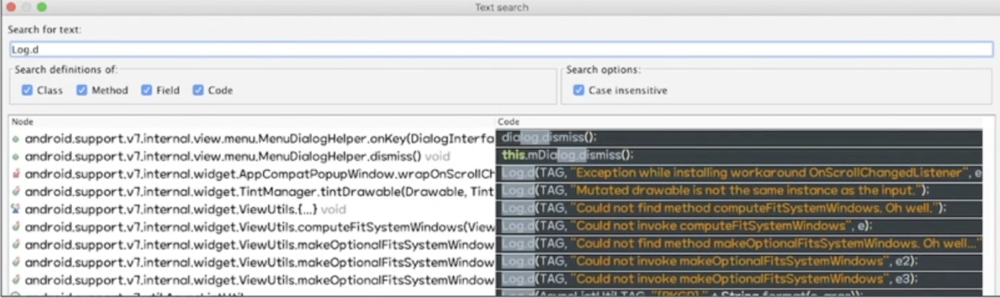

# 정보 노출 진단
- App의 동작으로 인해 노출 되서는 안되는 정보들이 노출되는 취약점
- App이 실행 중 사용자의 개인정보, 중요정보를 단말기에 저장할 경우, 단말기가 공격자에 의해 탈취 당하거나 악성 앱이 설치되어 단말기에 저장된 중요정보들이 노출될 수 있음
- App 통신 패킷이나 실행 파일에서 서버의 중요정보들이 노출되어 2차 공격에 이용될 수 있음

**정보 노출의 위험도**
- 서버의 중요 정보의 중요도에 따라 위험도는 높아질 수 있음
- 단말기 내에서 노출되는 개인정보, 중요정보 등은 실제 공격에서는 가정되어야 하는 조건(루팅, 잠금 설정 우회 등)이 많지만 무시할 수 없음

**정보 노출관련된 진단 항목 (금취분평 기준)**

금취분평 pdf 구해보자..;
- - -
- - -

>## 소스 코드에서의  정보노출
App 바이트 코드(dex), 디컴파일 소스 내에 존재하는 문자열에서 중요정보가 노출됨

### 주요 노출정보  
- string keyword : ip, port, user, password, key, http 등
- 내부 연동 서버 IP 및 포트 정보
- 관리자 계정
- 관리자 페이지 정보(URL)
- DB 서버 및 계정 정보

### App 바이트 코드 내 String 추출
App 바이트 코드를 추출하여 바이트 코드내 String 검색

### 정적 분석 Tool 활용하여 String 확인
IDA,jadx 등 Tool을 활용하여 디컴파일한 소스코드 내 String 검색

**대응 방안**
- 서비스에 사요되지 않는 개발용 서버정보들을 소스 코드에서 삭제
- 관리자 계정 정보 등 하드코딩 되어있는 인증 정보들은 소스 코드에서 삭제

**진단 시 주의사항 및 팁**
- 실제로 통신하는 서버 정보는 App에 들어가 있을 수 밖에 없기때문에 이를 보고 취약하다고 판단해서는 안됨
- 정적 분석 과정 중에서만 이 부분을 체크한다면 부석하지 못한 함수가 발생할 수 있으니, App 바이너리에서 String들을 한번씩 꼭 확인해볼 필요가 있음

>## 단말기 내 사용자 정보 저장

App 폴더 및 외부 저장소에 존재하는 파일 내에 사용자의 인증정보 및 개인정보들이 평문 또는 취약한 암호로 저장되어 노출됨

### 주요 노출 정보
- Search File : .db, shared_prefs, cache 등
- 개인정보
- 계정정보(자동로그인)
- 인증정보
- 암/복호화 키

### 진단 방법
- SharedPreference
- SD Card
- 안전하지 않은 외부 저장소
- 클립보드, 자동완성
- 정보 입력 후 변경된 파일 확인
- 명령어 팁

### 대응 방안
- androidallowbackup 설정
- Keystore 사용하여 안전한 키관리
- 자동완성, 클립보드 (서비스 영향도 파악하여 설정 고려)

### 진단 시 주의 사항 및 팁
- 단말기 내 알지 못하는 파일들로 중요 정보가 저장될 수 있으므로 파일 수정 시간을 체크하여 해당 취약점이 누락되지 않도록 점검해야함
- 중요 정보가 암호화 되어있어 보여도, MD5 디코딩으로 평무닝 되거나 복호화 키가 단말기 안전하지 않은 영역에 저장되어 있을 경우가 있음

>## 메모리 내 중요 정보 노출
이용자 단말기 메모리 내 개인정보 등 중요한 정보들이 평문 또는 취약한 암호화로 저장되어 노출됨

### 주요 노출 중요 정보
- String Keyword : jumin, token, user, password, key 등
- 개인정보
- 계정정보(자동로그인)
- 인증정보
- 암/복호화 키

### 진단 방법 (메모리 덤프)
#### Am : am을 사용하여 메모리 덤프

**메모리 덤프**

**strings을 이용한 문자열 추출**

#### Fridump : frida를 사용하여 메모리 덤프

### 대응 방안
- 중요 정보를 입력 받는 경우 가상 키패드를 사용하여 사용자의 입력부터 암호화를 적용해 데이터를 보호해야됨
- 주요 정보 및 개인정보의 경우 사용된 후 바로 메모리에서 사리질 수 있도록 화면이 넘어가기 전 해당 내용을 다른 내용으로 덮어쓰기
- 웹 Response에서 노출되는 중요 정보들은 웹 Response에서 중요 정보들이 마스킹 되어 응답 되도록 수정하는 것을 ㅗ해당 취약점을 보완할 수 있음

### 진단 시 주의 사항 및 팁
- 사용자의 개인 정보, 중요 정보를 일반 키패드로 입력을 받고 있는 경우 메모리에 노출되고 있을 가능성이 크기 때문에 주의해서 확인해 봐야함 (주민등록번호, 인증번호, 비밀번호 등)
- 웹 Response도 메모리에 작성되기 때문에 웹 Response에서 중요 정보가 포함되어 있는지 확인해 봐야함

>## 네트워크에서의 정보 노출
네트워크 통신 상에서 중요정보가 평문으로 노출되는 경우

### 주요 노출 중요 정보
- Search Keyword : ip, port, user, password, key 등
- 계정정보(ID,PW)
- 인증정보
- 개인정보
- 서버 중요정보

### 진단 방법
- Tcpdump
- Proxy tool -> http 통신 분석

### 대응 방안
- 주요 정보를 주고 받을 때는 평문으로 노출되지 않도록 암호화 통신을 적용해야 함
### 주의 사항 및 팁
- HTTPS 통신의 경우 암호화가 적용되어 데이터가 전달됙 때문에 인증서가 설치되어 있기 때문에 Proxy Tool을 이용해 평문으로 보인다고 취약하다고 판단해서는 안됨
- Proxy Tool을 이용해 취약점을 확인하여도 tcpdump 등 네트워크 패킷을 캡쳐하여 실제로 네트워크 구간에서 평문으로 오가는지 확인해야함

>## 백그라운드 화면 정보 노출
앱이 백그라운드 모드로 전환될 때 저장되는 스크린샷에서 개인의 정보가 평문으로 노출될 수 있음

### 주요 노출 중요 정보
- Search Keyword : 화면에 노출되는 개인정보
- 개인정보
- 인증정보

### 진단 방법
- 앱을 백그라운드 모드로 전환한 뒤 화면이 보호되는지 확인
- 화면이 보호되지 않고 있다면 단말기에 저장된 이미지 추출

### 대응 방안
- 백그라운드로 전환될 때 임의 지정한 사진 파일이 저장 될 수 있도록 변경해야함
ex) FLAG_SECURE 사용

### 주의 사항 및 팁
- 백그라운드 전환 후 이미지 파일을 추출하여 고객사에게 설명 (개인정보 포함되서 보이는 이미지)
- 백그라운드 스냅샷 경로는 기기 혹은 OS 버전 별로 다를 수 있음

>## 디버그 로그에서의 정보 노출
개발자들이 개발 중 디버깅을 위한 용도로 찍느 ㄴ로그에 개발 서버 정보나 곤리자 서버 주소 등 서버에 민감하고 중요한 정보들이 노출됨

### 주요 노출 중요 정보
- string keyword : ip, port, user, password, key, http 등
- 계정정보(ID/PW)
- 개인정보
- 함수 실행 Flow 및 인자, 리턴값
- 연동된 서버정보

### 진단 방법
- Logcat
- Log.* 함수 분석 (log.d, log.e 등등)

### 대응 방안
- 디버그 로그로 출력되는 중요 정보들을 직접 삭제
- debuggable 설정을 flase로 배포(release 모드로 배포)

### 주의사항 및 팁
- debuggable 옵셜을 true로 바꿔 리패키징한 뒤 디버그 로그 진단 하지 말아야함. debuggable 옵션을 true로 의도적으로 바꿀경우 디버그 로그가 출력되는 것은 당연함, 하지만 서버정보 중요 정보가 노출되는지 확인 하기 위해서는 필요함

