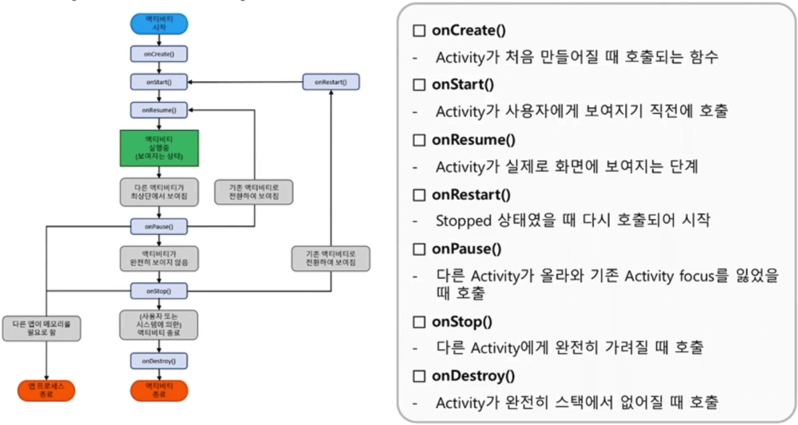

# Architecture
## Linux Kernel
 내용 추가~!!
## Android Runtime
- AOT(Ahead Of Time), JIT(Just In Time) 컴파일
- 최적화된 GC(Garbage Collector : 메모리 관리)

**달빅 VM(Dalvick Virtual Machine)과 ART(Ahead Of Time)**
- Andorid는 기본 언어를 JAVA를 사용하기 때문에 JVM 역할을 할 수 있는 VM 필요
- 안드로이드 구조에 최적화 시켜 만든 달빅 VM과 ART
- 가상머신이 dex 포맷의 바이트코드를 해석하여 안드로이드 어플리케이션을 실행하게 된다.

>**JIT(Just In Time)**  
>어플리케이션 구동 시 실시간으로 자바코드로 변환하며, 자바코드 일정부분 RAM 상에 상주
>
>장점 : 성능적으로 크게 향상됨  
>단점 : JIT 컴파일러 구동 시 하드웨어에 부하가 크게 발생하며, 다른 방식에 비해 RAM 사용량 증가

>**ART(Ahead Of Time)**  
>어플리케이션 설치 시 한 번에 컴파일하여 바이트 코드로 변환하여, 실행 시 변환된 코드를 사용  sdfii
>
>장점 : 성능적으로 크게 향상됨  
>단점 : 설치 공간이 달빅VM에 비해 약 1.5~2배 가량 더 필요하며, 설치 시간이 오래걸림
## Native Libraries
ART 및 HAL등의 많은 핵심 Android 시스템 구성 요소와 서비스는 C 및 C++로 작성된 네이티브 라이브러리를 필요로 하는 네이티브 코드 기반으로 빌드 되어 있음

>**NDK(Native Development Kit)**
>- C/C++(Native Code) 등의 언어로 앱 일부를 구현할 수 있는 도구
>- C/C++로 구현된 코드를 Android에서 사용될 수 있는 Library나 Binary로 만들어 주는 도구

>**JNI(Java Native Interface)**
>- Java 코드에서 C/C++로 만들어진 Library를 가능하게 해주는 인터페이스 제공
>- Java 코드에 Native 함수를 선언하면, Java Library 파일(.so)에서 매핑 되는 함수를 찾음

**NDK & JNI 연동**  
JNI 정보를 담고 있는 JNI_OnLoad() 함수가 로드하려는 labrary 파일 안에 구현되어 있을경우 수동매핑, 구현되어 있지 않은 경우 자동 매핑이 이루어짐

**자동매핑** : JNI_Onload() 함수가 없으면 DVM은 자동으로 라이브러리 내에 JNI Native 함수들을 비교해 매핑 작업을 수행 후 매핑된 함수 호출, 매핑 작업으로 인해 성능 저하의 원인이 됨

**수동매핑** : JNI_Onlod() 함수가 구현되어 있어 구현된 정보에 맞는 함수 호출, 개발자가 직접 연결해주는 작업이 필요하며 로딩 속도를 향상 시킬 수 있음


## Android Framework

## Build
윈도우 실행파일이 PE파일인 것처럼, 안드로이드의 실행파일은 dex이다.  
안드로이드는 dex파일을 달빅이라는 가상머신에서 구동 시킨다.  
달빅 가상머신은 모바일 기기에서 메모리를 적게 사용하면서 실행파일이 구동되도록 모바일에 최적화된 가상머신이다.  
OS에 하나가 있는 것이 아니라 어플리케이션마다 달빅가상머신이 생성되는 형태이다.(샌드박스 형식) . 
apk 개발을 위해 작성한 java코드를 컴파일한 클래스 파일(자바바이트 코드)을 dx 툴로 변환하면 dex(달빅바이트코드) 파일이 생성된다.  
java code → java bytecode → dex bytecode  
그리고 dx툴로 변환하는 과정에서 java의 바이트 코드(.class)가 달빅바이트코드(.dex)로 변환된다

>**DEX (Dalvik Excutable)**  
>
> Android 어플리케이션은 Dalvik VM에서 더 효과적으로 실행되기 위해 개발자가 JDK로 코드를 컴파일 하여 만든 바이트 코드는 Dalvik VM에서 DEX파일로 변환되어 실행됨

>[**Smali Code**](http://localhost:1313/android/smali_code/)
>- 달빅 바이트 코드를 위한 어셈블리 언어, DEX 바이너리를 사람이 읽기 편하게 표현한 언어
>- 재컴파일이 가능하므로 원하는 부분을 수정하여 코드 패칭이 가능하다.


## 코드 서명

- 앱 개발자가 누구인지 나타내기 위해 개발자가 자신의 코드서명인증서로 서명을 하는 것
- 악의적인 사용자가 패치한 앱의 배포를 막기 위해
- private key가 탈취 당했을경우 앱스토어에 App의 업그레이드 버전으로 배포가 가능해서 키관리 주의


## APK 구조


### AndoridManifest.xml
아래와 같은 App에 대한 정보가 명시되어 있음

- 고유한 패키지 이름
- Activity, Service, Broadcast Receiver, Instrumentation Definiton
- 권한 정의 (응용 프로그램이 요청한 권한 및 사용자 정의 모두)
- 응용 프로그램과 함께 패키지 되어 사용되는 외부 라이브러리에 대한 정보
- 공유 UID 정보, 기본 설치 위치 및 UI 정보

>공유 UID
>- 두 개 이상의 어플리케이션에서 동일한 사용자 식별자 지정이 가능함
>- 이 경우 앱들은 동일한 UID에서 실행되는데, 이를 통해 동일 UID를 가진 앱은 잠재적으로 서로 리소스에 접근 가능

#### Activity
- 사용자와 상호작용하기 위한 진입점으로 UI를 포함한 화면 하나를 나타냄
- 사용자가 현재 관심을 가지고 있는 화면을 추적하여 계속 실행하게 함
- Activity Manager에서 위와 같은 일들을 처리함





#### Service
백그라운드에서 앱을 계속 실행하기 위한 다목적 진입점으로 백그라운등서 실행되며 오랫동안 실행되는 작업을 수행하거나 원격 프로세스를 위한 작업을 수행


#### Broadcast Receiver
시스템이 정기적인 사용자 플로우 밖에서 이벤트를 앱에 전달하도록 지원하며, 앱이 시스템 전체의 브로드캐스트 알림에 응답할 수 있도록 도와줌


#### Content Providers
파일 시스템, SQLite DB, 웹상이나 앱이 액세스할 수 있는 다른 모든 영구 저장 위치에 저장 가능한 앱 데이터의 공유에 있어 읽기, 쓰기 권한 관리 역할, Content Providers를 구성하여 다른 어플리케이션들과 안전하게 데이터 공유가 가능함


## AndoridManifest.xml 간단한 분석
앱 진단 전에 확인하여 앱이 어떤 동작을 하는지 유추 해볼 수 있다.

```xml
<?xml version="1.0" encoding="utf-8" standalone="no"?><manifest xmlns:android="http://schemas.android.com/apk/res/android" package="jakhar.aseem.diva" platformBuildVersionCode="23" platformBuildVersionName="6.0-2166767">
    <uses-permission android:name="android.permission.WRITE_EXTERNAL_STORAGE"/> //외부 저장소(sd카드) 쓰기 권한                  // 안드로이드 패키지 이름
    <uses-permission android:name="android.permission.READ_EXTERNAL_STORAGE"/> // 외부 저장소(sd카드) 읽기 권한
    <uses-permission android:name="android.permission.INTERNET"/> // 외부와 통신 하는 권한
    <application android:allowBackup="true" android:debuggable="true" android:icon="@mipmap/ic_launcher" android:label="@string/app_name" android:supportsRtl="true" android:theme="@style/AppTheme">
                                    ㄴ백업허용		              ㄴdebugable="true" 디버깅이 가능함 취약한 설정, 
<activity android:label="@string/app_name" android:name="jakhar.aseem.diva.MainActivity" android:theme="@style/AppTheme.NoActionBar">
            <intent-filter>
                <action android:name="android.intent.action.MAIN"/>. // 이 속성이 들어가있는 액티비티는 앱에서 가장 먼저 실행되는 액티비티이다. -> jakhar.aseem.diva.MainActivity
                <category android:name="android.intent.category.LAUNCHER"/>
            </intent-filter>
        </activity>
        <activity android:label="@string/d1" android:name="jakhar.aseem.diva.LogActivity"/>
        <activity android:label="@string/d2" android:name="jakhar.aseem.diva.HardcodeActivity"/>
        <activity android:label="@string/d3" android:name="jakhar.aseem.diva.InsecureDataStorage1Activity"/>
        <activity android:label="@string/d4" android:name="jakhar.aseem.diva.InsecureDataStorage2Activity"/>
        <activity android:label="@string/d5" android:name="jakhar.aseem.diva.InsecureDataStorage3Activity"/>
        <activity android:label="@string/d6" android:name="jakhar.aseem.diva.InsecureDataStorage4Activity"/>
        <activity android:label="@string/d7" android:name="jakhar.aseem.diva.SQLInjectionActivity"/>
        <activity android:label="@string/d8" android:name="jakhar.aseem.diva.InputValidation2URISchemeActivity"/>
        <activity android:label="@string/d9" android:name="jakhar.aseem.diva.AccessControl1Activity"/>
        <activity android:label="@string/apic_label" android:name="jakhar.aseem.diva.APICredsActivity">
            <intent-filter>
                <action android:name="jakhar.aseem.diva.action.VIEW_CREDS"/>
                <category android:name="android.intent.category.DEFAULT"/>
            </intent-filter>
        </activity>
        <activity android:label="@string/d10" android:name="jakhar.aseem.diva.AccessControl2Activity"/>
        <activity android:label="@string/apic2_label" android:name="jakhar.aseem.diva.APICreds2Activity">
            <intent-filter>
                <action android:name="jakhar.aseem.diva.action.VIEW_CREDS2"/>
                <category android:name="android.intent.category.DEFAULT"/>
            </intent-filter>
        </activity>
        <provider android:authorities="jakhar.aseem.diva.provider.notesprovider" android:enabled="true" android:exported="true" android:name="jakhar.aseem.diva.NotesProvider"/>
                    // provider 에 exported="true" 이면 외부 앱에서 이 프로바이더를 사용할 수 있음, 프로바이더의 적절한 권한 설정되어 있는지 확인해야한다.
        <activity android:label="@string/d11" android:name="jakhar.aseem.diva.AccessControl3Activity"/>
        <activity android:label="@string/d12" android:name="jakhar.aseem.diva.Hardcode2Activity"/>
        <activity android:label="@string/pnotes" android:name="jakhar.aseem.diva.AccessControl3NotesActivity"/>
        <activity android:label="@string/d13" android:name="jakhar.aseem.diva.InputValidation3Activity"/>
    </application>
</manifest>
```
