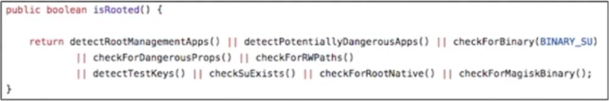
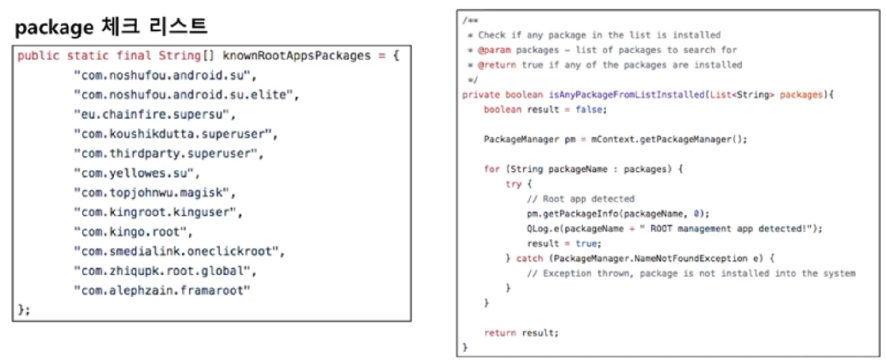
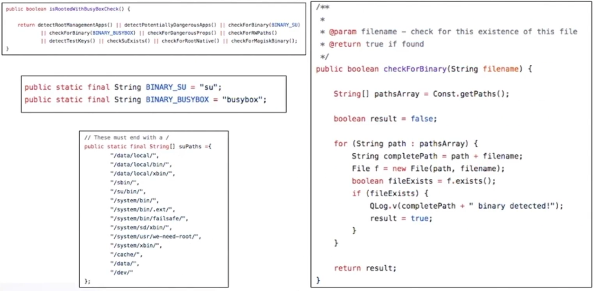
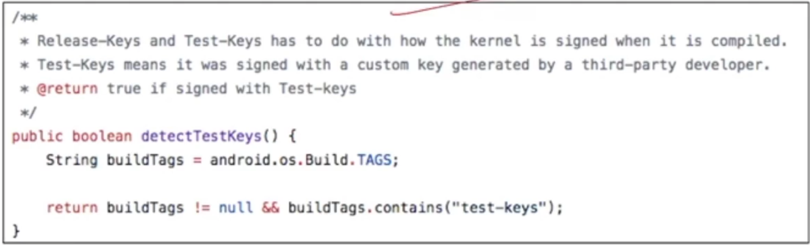
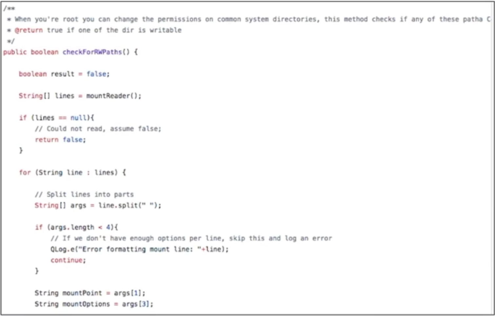
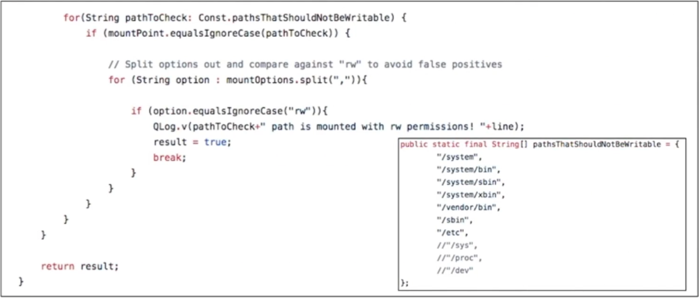
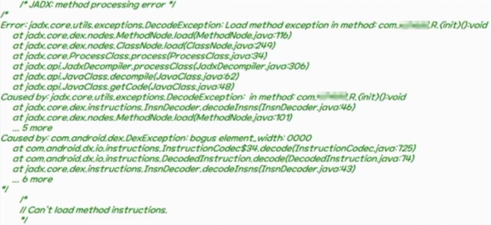
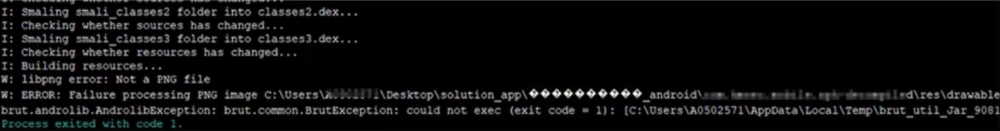
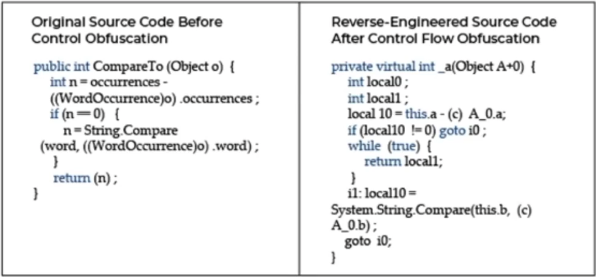

# Android 보안 솔루션
>## 루팅 탐지
- 공격자들의 App 분석 및 공격을 방해하기 위해 탐지
- 사용자들에게 해당 App이 루팅된 기기에서 실행될 경우 위험하다는 것을 경고하기 위해 탐지 (특히, 금융App)

### 루팅 탐지 원리
루팅이 되었을 때 나타나는 특징들을 확인하여 루팅을 탐지

### 루팅 탐지 방법
- 설치된 package 확인  
- 루팅했을 때 설치되는 App이 존재하는지 확인하여 루팅 탐지  
- pm을 이용하여 확인

 **파일 확인**  
- su binary, busybox 등 파일 확인

    
**build.prop 파일에서 기본값 확인**
- 루팅을 하게 되면 /system/build.prop 파일에 test-keys로 설정 되어 있는 것을 확인
- 안드로이드에서 ro.build.tag 릴리즈 키로 설정되어 있는데 루팅을 한경우 test-keys로 설정됨

**Directory Permission 확인**
- system directory 등의 디렉토리의 권한을  변경했는지 체크

마운트 정보를 확인하여 rw 권한을 확인, 테스트 파일을 임의 경로로 생성하여 생성이 되는지 확인

>## 무결성 검증

>## Anti-Debugging

>## 문자열 난독화

>## Mobile Solution Trick
### 1. Decompile 방해

decompile tool이 정상적으로 동적하지 못하도록해 분서을 어렵게 만듬

ex) Invlid fill-array-data trick, Trunchted method trick

#### 대처 방법

→ tool의 smali version update  
→ truncated method를 무시하도록 nop 코드로 치환
### 2. Repackaging 방해

→ Repackaging을 방해하여 App을 쉽게 변조하지 못하도록 함  
ex) AndroidManifest.xml 변조, Bad Resouce

#### 대처 방법

→ AndroidManifest.xml 의 난돋화된 이름 속성값을 바이너리로 변환  
→ Bad Resouce를 정상 Resource로 교체

### 3. Dex 암호화 및 동적 로딩

→ 고객의 코드를 보호하기 위해 DEX 또는 .so 파일을 암호화하여 저장한 뒤, 앱이 실행될 때 다음 API들을 이용하여 동적으로 로드함

DexClassLoader(Dalvik), BaseDexClassLoader  
PatchClassLoader(ART)  
dlopen(Native shared object)  

#### 대처 방법

→ Low Level API 함수를 후킹하여 DEX / .so 파일 가로채기
: DexFileLoader, OpenCommon, OpenAndReadMagic, dlopen
→ File Deletion 함수 후킹하여 삭제 막기
: unlink call을 후킹하여 파일 삭제를 막을 수 있음

### 4. Frida, remote debugging 탐지 (socket check)

→ Frida를 탐지하기 위해 Frdia-server가 열어놓은 포트를 확인
→ 직접 해당포트에 연결해보는 방법으로 확인

#### 대처 방법

→ 소켓 연결 함수 후킹
: 소켓 연결하는 함수를 후킹하여 연결에 실패하도록 변조

### 5. 코드 흐름 난독화

→ 실행되는 코드의 흐름을 난독화하여 분석을 방해함

#### 대처 방법

→ 불필요한 쓰레기 더미 코드들을 제거하며 분석