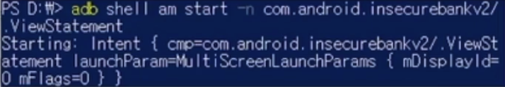
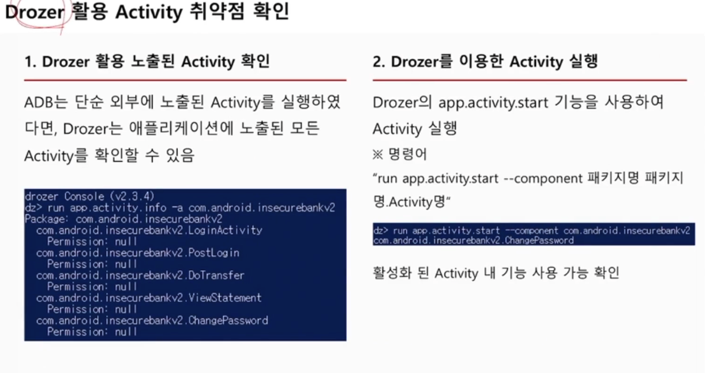
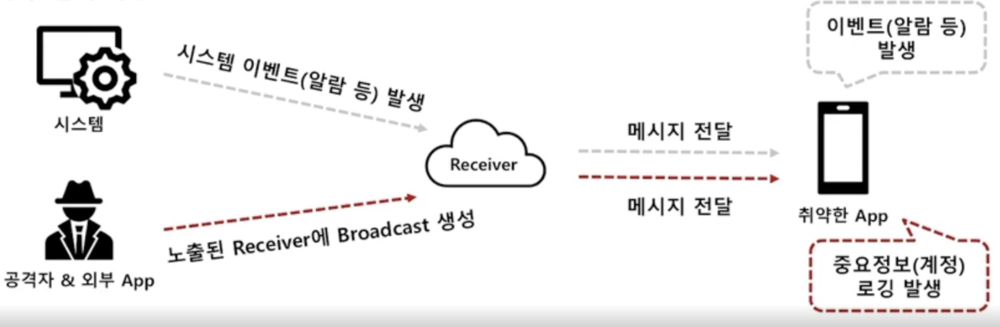
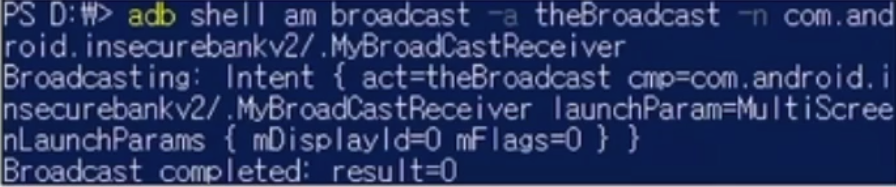
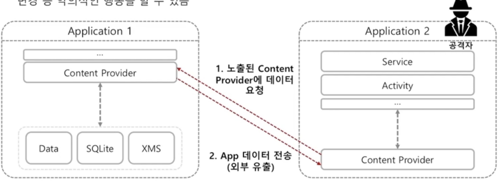
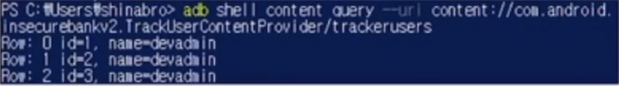
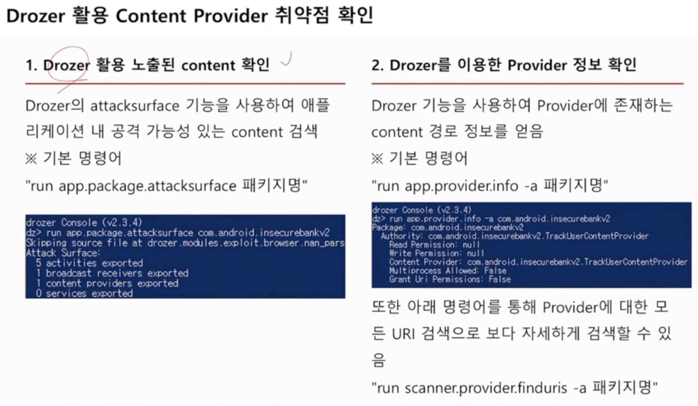
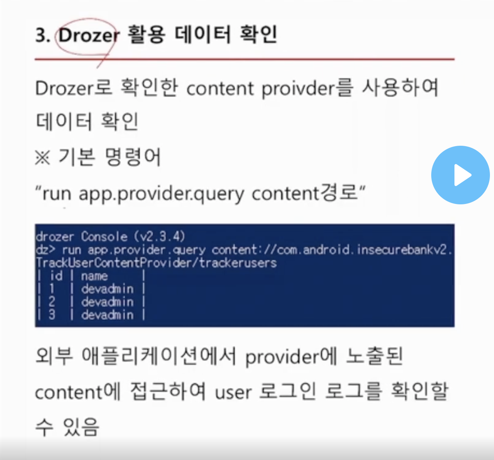

# Android 취약점
- android App 기능 혹은 잘못된 설정에 의한 취약점

**Android 취약점 관련 진단 항목 (금취분평 기준)**
- 화면 강제실행에 의한 인증단계 우회
- 인증 및 인가 관련 항목
- 정보 노출 관련 항목

**Android 취약점 발견 위치**
- Activity
- Broadcase Receiver
- Content Provider

- - - 

## Activity 컴포넌트 취약점
Android Activity는 화면에 표시되는 UI 구성을 위해 가장 기본이 되는 요소이며, 각각 독립적으로 동작하기 때문에 보안적으로 취약하게 선언되어 있을 경우, 원하는 activity를 강제로 호출 가능한 취약점

### 위협
- 공격자가 필요한 Activity를 강제로 호출하며 , 해당 취약점을 악용하는 경우 `인증절차`를 우회하여 권한이 없는 Activity에 접근하여 특정 기능을 사용할 수 있음
### 진단방법 
**ADB활용 Activity 취약점 확인**
- AndroidManifest.xml 확인  
`activity android:exported="true"`   다른 애플리케이션에서 activity 실행 가능  
`activity android:exported="false"`   동일한 애플리케이션 또는 UID를 가진 애플리케이션에서만 실행 가능

- ADB를 이용한 Activity 실행 (am 명령어 사용)  
`adb shell am start -n 패키지명/.Activity 경로`  
활성화 된 Activity 내 기능 사용 가능 확인

**Drozer 활용 Activity 취약점 확인**

### 대응방안 
- 노출된 Activity에 바로 접근하지 못하도록 exported 속성을 false로 변경

### 진단 시 주의사항 및 팁
- 진단 시 AndroidManifest.xml 파일을 잘 분석해야하며, 여기서 해당 취약점이 존재하는지 파악할 수 있음
- 인증과 관련된 Activity에서 해당 취약점이 많이 발견됨

>## Broadcase Receiver 취약점
Android Broadcase Receiver는 백그라운드에서 대기하고 있다가 이벤트 발생 시 시스템에서 전달한 메시지 Intent를 모든 애플리케이션에게 전달하는 역할. 메시지를 수신한 애플리케이션은 그에 맞는 응답 메시지를 사용자에게 전달

### 위협
- 공격자는 시스템 대신 임의의 악의적인 메시지를 특정 애플리케이션의 노출된 Receiver에 전송하여 응답오는 데이터를 가로채는 행위를 할 수 있음
- 응답되는 데이터에 애플리케이션이 가지고 있는 중요정보(개인정보, 계정정보)가 포함되어 있을 경우 탈취 가능

### 진단방법
**ADB활용 Boradcase Receiver 취약점 확인**
- AndroidManifest.xml 확인  
`receiver android:exported="true"` -> 다른 애플리케이션에서 intent 가능  
- ADB를 이용한 BroadCase 생성 (am 명령어 사용)    
`adb shell am broadcase -a Action_name -n 패키지명/.Receiver경로`  

  

Broadcase 생성 결과는 App 구현에 따라 다르며, App log 정보(logcat)나 App 알람을 통해 확인 가능

### 대응방안
- 노출된 Broadcase Receiver에 외부 애플리케이션에서 발생하는 intent에 영향을 받지 않도록 exported 속성을 false로 변경
- 각 Receiver 별로 권한(Permission)을 주어 외부 애플리케이션에 대한 접근 권한을 관리

### 진단 시 주의사항 및 팁
- 진단 시 `Androidmanifest.xml` 파일을 잘 분석해야하며, 여기서 해당 취약점이 존재하는지 파악할 수 있음

>## Content Provider 취약점
Content Provider는 다른 애플리케이션의 데이터베이스나 파일에 접글할 수 있는 인터페이스를 제공, 허용된 데이터, 파일에만 접근 가능하도록 하는 권한 설정이 부재일 때 발생하는 취약점

### 위협
- 공격자는 사용자가 공유하기를 원하는 데이터 외 데이터에 비정상적으로 접근하여 중요한떼이터 조회/변경 등 악의적인 행동을 할 수 있음

### 진단방법
**ADB 활용 Content Provider 취약점 확인** 
1. AndroidManifest.xml 확인  
`provider android:exported="true"` -> 다른 애플리케이션에서 provider 실행 가능
`provider android:exported="false"` -> 동일한 애플리케이션 또는 UID를 가진 애플리케이션에서만 실행 가능   
2. Content URI 탐색  
디컴파일한 소스코드 내 노출된 Content URI를 검색 `(keyword: content://)`

3. ADB를 이용한 Cotent Provider 확인  
`adb shell content query --uri content경로` -> 2번에서 확인된 경로

-> 외부 애플리케이션에서 providerd에 노출된 content에 접근하여 user 로그인 로그를 확인할 수 있다

**Drozer 활용 Content Provider 취약점 확인**

### 대응방안
- Content Provider에 안전한 Permission을 설정 (protectionLevel 속성 이용)  
`nomal` : protectionLevel의 기본 값으로서 단순히 기능을 사용하기 위한 식별 값으로 사용되는 퍼미션  
`dangerous` : 사용자 개인 데이터나 시스템 제어 기능을 식별하는 퍼미션  
`signature` : 동일한 서명 값으로 컴파일 된 앱끼리 기능을 허용하고자 할 때 사용하는 퍼미션  
`system` : 안드로이드 시스템 이미지로 설치되는 앱을 허용 할 때 사용하는 퍼미션  

### 진단 시 주의사항 및 팁
- 진단 시 `Androidmanifest.xml` 파일을 잘 분석해야하며, 여기서 해당 취약점이 존재하는지 파악할 수 있음
